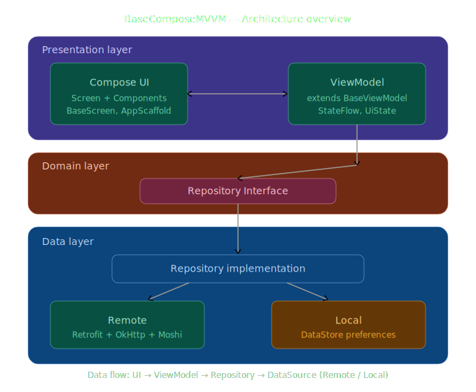

# BaseComposeMVVM

A standardized, production-ready Android base source project built with **MVVM + Jetpack Compose + Hilt**. Provides a flexible, extensible foundation for rapidly bootstrapping new Android projects.

## Architecture
The project follows the **MVVM (Model-View-ViewModel)** architecture with the Repository pattern:



**Data Flow:** UI → ViewModel → Repository → DataSource (Remote / Local)

## Tech Stack

| Library | Version | Purpose |
|---|---|---|
| Kotlin | 2.0.21 | Primary language |
| Jetpack Compose (BOM) | 2024.12.01 | Declarative UI toolkit |
| Material3 | (BOM) | Design system |
| Hilt | 2.51.1 | Dependency Injection |
| Navigation Compose | 2.7.7 | Screen navigation |
| Lifecycle | 2.8.7 | ViewModel, lifecycle-aware components |
| Retrofit | 2.11.0 | Type-safe HTTP client |
| OkHttp | 4.12.0 | HTTP engine, interceptors, caching |
| Moshi | 1.15.1 | JSON serialization / deserialization |
| Coil | 2.6.0 | Image loading (Compose-native) |
| DataStore | 1.1.1 | Local key-value storage |
| Timber | 5.0.1 | Logging (debug builds only) |
| Chucker | 4.0.0 | HTTP traffic inspector (debug builds only) |
| Splash Screen API | 1.0.1 | Android 12+ splash screen |
| Coroutines | 1.8.1 | Asynchronous programming |
| Kotest | 5.9.1 | Property-based testing |
| MockK | 1.13.12 | Mocking framework |
| Turbine | 1.1.0 | Flow testing utilities |

## Project Structure

```
app/src/main/java/com/example/basecomposemvvm/
├── App.kt                              # @HiltAndroidApp Application
├── MainActivity.kt                     # @AndroidEntryPoint, Edge-to-Edge, Splash
├── Constant.kt                         # App-wide constants
│
├── core/
│   ├── base/
│   │   ├── BaseViewModel.kt            # Loading count, error, navigation
│   │   ├── BaseScreen.kt               # Loading overlay, error dialog, pull-to-refresh
│   │   └── BaseUiState.kt              # BaseUiState interface + UiEvent sealed class
│   ├── navigation/
│   │   ├── AppDestination.kt           # Sealed class destinations
│   │   └── AppNavigation.kt            # NavHost setup
│   └── network/
│       ├── ApiException.kt             # API error wrapper
│       ├── ErrorResponse.kt            # Error response model
│       ├── NoConnectivityException.kt  # No network connectivity error
│       ├── ErrorMapping.kt             # Exception → user-friendly mapping
│       ├── ResponseMapping.kt          # flowTransform utility
│       ├── AuthInterceptor.kt          # Auth headers interceptor
│       ├── ConnectivityObserver.kt     # Interface + Status enum
│       └── NetworkConnectivityObserver.kt
│
├── data/
│   ├── local/datastore/
│   │   └── PreferenceDataStore.kt      # Token storage interface + implementation
│   ├── remote/
│   │   ├── api/ApiService.kt           # Retrofit API interface
│   │   └── repository/AppRepository.kt # Repository interface + implementation
│   └── model/base/
│       └── BaseResponse.kt             # Generic API response wrapper
│
├── di/
│   ├── NetworkModule.kt                # Retrofit, OkHttp, Moshi providers
│   ├── CoroutinesModule.kt             # IO, Default, Main dispatcher providers
│   ├── CoroutinesQualifiers.kt         # @IoDispatcher, @DefaultDispatcher, @MainDispatcher
│   ├── StorageModule.kt                # DataStore provider
│   ├── MoshiBuilderProvider.kt         # Moshi singleton provider
│   └── RepositoryModule.kt             # Repository bindings
│
├── designsystem/
│   ├── theme/
│   │   ├── Theme.kt                    # AppTheme (Material3 lightColorScheme)
│   │   ├── Color.kt                    # Color palette
│   │   └── Type.kt                     # Typography with custom font family
│   └── component/
│       ├── AppLoading.kt               # CircularProgressIndicator
│       ├── AppAlertDialog.kt           # Alert dialog
│       ├── AppButton.kt                # Material3 button
│       ├── AppTopBar.kt                # Top app bar
│       ├── AppNetworkImage.kt          # Coil image loader
│       └── AppScaffold.kt              # Scaffold wrapper
│
├── feature/
│   └── splash/SplashScreen.kt          # Splash → Home navigation
│
└── utils/
    ├── extension/
    │   ├── FlowExt.kt                  # collectAsEffect()
    │   └── Modifier.kt                 # thenIf(), applyIf(), click debounce
    └── DisposableEffectWithLifecycle.kt # Lifecycle-aware side effects
```

## Prerequisites

- Android Studio Hedgehog (2023.1.1) or later
- JDK 17
- Android SDK: compileSdk 35, minSdk 26
- Gradle 8.x (Gradle Wrapper included)

## Getting Started

1. Clone the repository:
   ```bash
   git clone <repository-url>
   cd BaseComposeMVVM
   ```

2. Open the project in Android Studio.

3. Sync Gradle (Android Studio will auto-sync on project open).

4. Run the app:
   ```bash
   ./gradlew installDebug
   ```

## Environment Configuration

### BASE_URL

The base URL is configured via `buildConfigField` in `app/build.gradle.kts`:

```kotlin
buildTypes {
    debug {
        buildConfigField("String", "BASE_URL", "\"https://api.example.com/\"")
    }
    release {
        buildConfigField("String", "BASE_URL", "\"https://api.production.com/\"")
    }
}
```

Access in code:
```kotlin
BuildConfig.BASE_URL
```

### API Keys and Secrets

Add to `local.properties` (this file is git-ignored):
```properties
API_KEY=your_api_key_here
```

Read in `app/build.gradle.kts`:
```kotlin
val localProperties = Properties().apply {
    val file = rootProject.file("local.properties")
    if (file.exists()) load(file.inputStream())
}

buildConfigField("String", "API_KEY", "\"${localProperties["API_KEY"]}\"")
```

## Creating a New Feature



### 1. Create the Screen

```kotlin
// feature/myfeature/MyFeatureScreen.kt
@Composable
fun MyFeatureScreen(
    viewModel: MyFeatureViewModel = hiltViewModel(),
    onNavigateBack: () -> Unit = {}
) {
    val uiState by viewModel.uiState.collectAsStateWithLifecycle()
    val isLoading by viewModel.isLoading.collectAsStateWithLifecycle()
    val error by viewModel.error.collectAsStateWithLifecycle()

    BaseScreen(
        showLoading = isLoading,
        errorMessage = error?.message.orEmpty(),
        clearErrorMessage = { /* reset error */ }
    ) {
        // UI content
    }
}
```

### 2. Create the ViewModel

```kotlin
// feature/myfeature/MyFeatureViewModel.kt
@HiltViewModel
class MyFeatureViewModel @Inject constructor(
    private val repository: MyFeatureRepository
) : BaseViewModel() {

    private val _uiState = MutableStateFlow(MyFeatureUiState())
    val uiState: StateFlow<MyFeatureUiState> = _uiState.asStateFlow()

    fun loadData() {
        launch {
            repository.getData()
                .loading()
                .async { data ->
                    _uiState.update { it.copy(items = data) }
                }
        }
    }
}

data class MyFeatureUiState(
    override val errorMessage: String = "",
    override val showLoading: Boolean = false,
    val items: List<Item> = emptyList()
) : BaseUiState
```

### 3. Create the Repository

```kotlin
// data/remote/repository/MyFeatureRepository.kt
interface MyFeatureRepository {
    fun getData(): Flow<List<Item>>
}

class MyFeatureRepositoryImpl @Inject constructor(
    private val apiService: ApiService
) : MyFeatureRepository {
    override fun getData(): Flow<List<Item>> = flowTransform {
        apiService.getData().data.orEmpty()
    }
}
```

### 4. Register the DI Binding

```kotlin
// di/RepositoryModule.kt — add binding
@Binds
@Singleton
abstract fun bindMyFeatureRepository(
    impl: MyFeatureRepositoryImpl
): MyFeatureRepository
```

### 5. Register the Navigation Route

```kotlin
// core/navigation/AppDestination.kt — add destination
object MyFeature : AppDestination("my_feature")

// core/navigation/AppNavigation.kt — add route
composable(AppDestination.MyFeature) {
    MyFeatureScreen()
}
```

## Commit Convention

This project follows [Conventional Commits](https://www.conventionalcommits.org/):

| Prefix | Purpose | Example |
|---|---|---|
| `feat` | New feature | `feat: add user profile screen` |
| `fix` | Bug fix | `fix: resolve crash on empty list` |
| `refactor` | Code restructuring | `refactor: extract base repository` |
| `docs` | Documentation | `docs: update README setup guide` |
| `chore` | Maintenance | `chore: update dependencies` |
| `test` | Add/update tests | `test: add ViewModel unit tests` |
| `style` | Code formatting | `style: apply ktlint formatting` |

Format: `<type>(<scope>): <description>`

Examples:
```
feat(auth): implement login screen with biometric support
fix(network): handle timeout exception correctly
```

## Branching Strategy

```
main          ← Production-ready code
├── develop   ← Integration branch
│   ├── feature/login       ← New feature
│   ├── feature/profile
│   ├── bugfix/crash-fix    ← Bug fix
│   └── release/1.0.0       ← Release preparation
```

| Branch | Purpose | Merges into |
|---|---|---|
| `main` | Production code, always stable | — |
| `develop` | Feature integration | `main` (via release) |
| `feature/*` | New feature development | `develop` |
| `bugfix/*` | Bug fixes | `develop` |
| `release/*` | Release preparation | `main` + `develop` |
| `hotfix/*` | Critical production fixes | `main` + `develop` |

## License

```
MIT License — See LICENSE file for details.
```
